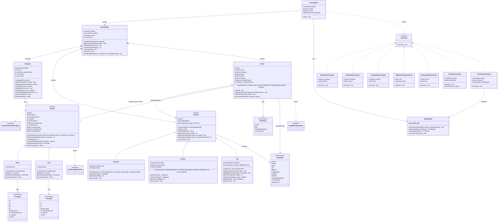

# Mutyi Tycoon – UML Osztálydiagram

```mermaid
classDiagram
    direction TB

    %% ===== MODEL: LOCATION HIERARCHY =====
    class Location {
        <<abstract>>
        -String id
        -String displayName
        -Map~CargoType, Integer~ inventory
        +Location(String id, String displayName)
        +getId() String
        +getDisplayName() String
        +getStock(CargoType cargo) int
        +addCargo(CargoType cargo, int amount) void
        +takeCargo(CargoType cargo, int requestedAmount) int
        +processTurn()* void
    }

    class Producer {
        -CargoType outputCargo
        -int productionRate
        +Producer(String id, String displayName, CargoType outputCargo, int productionRate)
        +getOutputCargo() CargoType
        +getProductionRate() int
        +processTurn() void
    }

    class Factory {
        -CargoType inputCargo
        -CargoType outputCargo
        -int processingRate
        +Factory(String id, String displayName, CargoType inputCargo, CargoType outputCargo, int processingRate)
        +getInputCargo() CargoType
        +getOutputCargo() CargoType
        +getProcessingRate() int
        +processTurn() void
    }

    class City {
        -Set~CargoType~ demands
        -Map~CargoType, Integer~ fulfilledDemands
        +City(String id, String displayName)
        +addDemands(CargoType cargo) void
        +addfulfill(CargoType cargo, int amount) void
        +getFulfill(CargoType cargo) int
        +demands(CargoType cargo) boolean
        +getDemands() Set~CargoType~
        +processTurn() void
    }

    Location <|-- Producer
    Location <|-- Factory
    Location <|-- City

    %% ===== MODEL: VEHICLE HIERARCHY =====
    class Vehicle {
        <<abstract>>
        -String id
        -double speed
        -int maintenanceCost
        -int capacity
        -int purchasePrice
        -CargoType currentCargo
        -int currentAmount
        -double currentPosition
        -boolean movingForward
        -Route assignedRoute
        +Vehicle(String id, double speed, int maintenanceCost, int capacity, int purPrice)
        +loadCargo(CargoType cargo, int amount) int
        +unloadCargo() int
        +canTravelOn(RouteType routeType) boolean
        +getRequiredRouteType()* RouteType
        +getVersionName()* String
    }

    class Truck {
        -TruckType type
        +Truck(String id, TruckType type)
        +getType() TruckType
        +getRequiredRouteType() RouteType
        +getVersionName() String
    }

    class Train {
        -TrainType type
        +Train(String id, TrainType type)
        +getType() TrainType
        +getRequiredRouteType() RouteType
        +getVersionName() String
    }

    Vehicle <|-- Truck
    Vehicle <|-- Train

    %% ===== MODEL: ROUTE & COMPANY =====
    class Route {
        -String id
        -Location source
        -Location destination
        -RouteType type
        -double distance
        -boolean unlocked
        -CargoType assignedCargo
        -List~Vehicle~ assignedVehicle
        +Route(String id, Location source, Location destination, RouteType type, double distance)
        +unlock() void
        +setAssignedCargo(CargoType assignedCargo) void
        +addVehicle(Vehicle vehicle) void
        +removeVehicle(Vehicle vehicle) boolean
    }

    class Company {
        -String companyName
        -int money
        -List~Vehicle~ ownedVehicles
        -int nextTruckId
        -int nextTrainId
        +Company(String name)
        +addVehicle(Vehicle vehicle) void
        +sellVehicle(Vehicle vehicle) boolean
        +canAfford(int cost) boolean
        +addMoney(int income) void
        +spendMoney(int cost) boolean
        +calculateTotalMaintenanceCost() int
        +generateTruckId() String
        +generateTrainId() String
    }

    %% ===== ENUMS =====
    class CargoType {
        <<enumeration>>
        GRAIN
        WOOD
        IRON
        OIL
        BREAD
        FURNITURE
        SCREW
        PETROL
        -String displayName
        -int baseValue
        -boolean raw
    }

    class RouteType {
        <<enumeration>>
        ROAD
        RAIL
        -String displayName
        -int unlockCost
    }

    class TruckType {
        <<enumeration>>
        V1
        V2
        V3
        V4
        V5
        -double speed
        -int maintenanceCost
        -int capacity
        -int price
    }

    class TrainType {
        <<enumeration>>
        V1
        V2
        V3
        -double speed
        -int maintenanceCost
        -int capacity
        -int price
    }

    %% ===== CONTROLLER & PERSISTENCE & UI =====
    class GameEngine {
        -Company company
        -List~Location~ locations
        -List~Route~ routes
        -int currentTurn
        +GameEngine(Company company)
        +addLocation(Location location) void
        +addRoute(Route route) void
        +numOfUnlockedRoutes() int
        +moveVehicles() void
        +nextTurn() void
        -handleEndpoint(Vehicle v, Location loc, CargoType cargo) void
    }

    class SaveManager {
        -String SAVE_DIR$
        +saveGame(GameEngine engine, String saveName) void
        +loadGame(String saveName) GameEngine
        +getAvailableSaves() List~String~
        -ensureDirectoryExists() void
    }

    class ConsoleMenu {
        -GameEngine engine
        -Scanner scanner
        -boolean running
        -SaveManager saveManager
        +start() void
    }

    %% ===== COMMAND PATTERN =====
    class Command {
        <<interface>>
        +execute() void
    }

    class BuyVehicleCommand {
        -Company company
        -Vehicle vehicle
        +execute() void
    }

    class SellVehicleCommand {
        -Company company
        -Vehicle vehicle
        +execute() void
    }

    class UnlockRouteCommand {
        -Company company
        -Route route
        +execute() void
    }

    class SetRouteCargoCommand {
        -Route route
        -CargoType cargo
        +execute() void
    }

    class AssignVehicleCommand {
        -Vehicle vehicle
        -Route route
        +execute() void
    }

    class NextTurnCommand {
        -GameEngine engine
        -boolean gameOver
        +execute() void
        +isGameOver() boolean
    }

    class SaveGameCommand {
        -GameEngine engine
        -String saveName
        -SaveManager saveManager
        +execute() void
    }

    Command <|.. BuyVehicleCommand
    Command <|.. SellVehicleCommand
    Command <|.. UnlockRouteCommand
    Command <|.. SetRouteCargoCommand
    Command <|.. AssignVehicleCommand
    Command <|.. NextTurnCommand
    Command <|.. SaveGameCommand

    %% ===== EXCEPTIONS =====
    class InsufficientFundsException {
        <<exception>>
    }
    class InvalidCargoException {
        <<exception>>
    }
    class InvalidRouteException {
        <<exception>>
    }

    %% ===== RELATIONSHIPS & MULTIPLICITIES =====
    GameEngine "1" *-- "1" Company : manages
    GameEngine "1" *-- "0..*" Location : contains
    GameEngine "1" *-- "0..*" Route : contains
    Company "1" o-- "0..*" Vehicle : owns
    Route "1" --> "2" Location : connects (source, dest)
    Route "0..1" o-- "0..*" Vehicle : assignedVehicles
    Route "1" --> "1" RouteType : type
    Route "1" --> "0..1" CargoType : assignedCargo
    Truck "1" --> "1" TruckType : type
    Train "1" --> "1" TrainType : type
    Location "1" --> "0..*" CargoType : inventory
    ConsoleMenu "1" --> "1" GameEngine : controls
    ConsoleMenu "1" --> "1" SaveManager : uses
    ConsoleMenu ..> Command : invokes
    SaveGameCommand --> SaveManager : delegates
    Company ..> InsufficientFundsException : throws
    Vehicle ..> InvalidCargoException : throws
    Route ..> InvalidRouteException : throws
```
